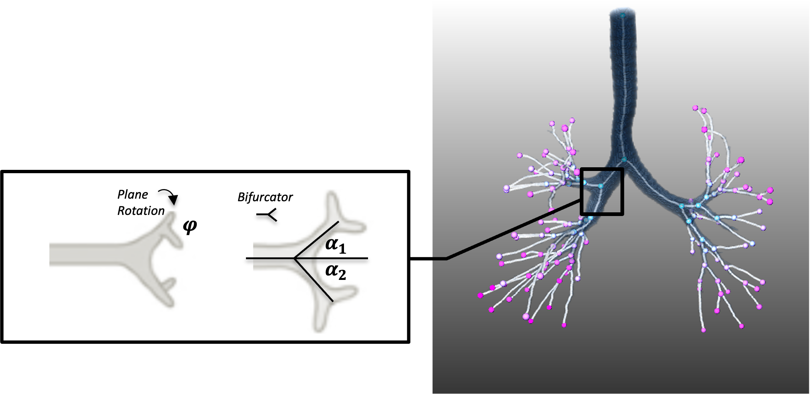

# Paths-of-Bifurcation Inference for Hidden Markov Modelling of Binary Trees




Implementation of the paper

_Demonstrating the capacity of a Path-Based variational inference formulation for robust hidden Markov modelling of complex and noisy binary trees_.


Submitted for publication at [ICLR 2024](https://openreview.net/) 


<!-- - Python 3.9.7
- Pytorch 1.11.0
- cudatoolkit=11.3 -->

## Installation

Clone the repository

```bash
git clone XXX/paths-of-bifurcations-hmm
cd paths-of-bifurcations-hmm
```
### Requirements

Create a new environment with [Conda](https://docs.conda.io/en/latest/)

- Python 3.9.7
- Pytorch 1.11.0
- cudatoolkit=11.3

Additional requirements:

    - pandas==1.5.1
    - scipy==1.10.1
    - torch==1.13.0
    - tqdm==4.64.1
    - pyro-api==0.1.2
    - pyro-ppl==1.8.4
    - seaborn==0.11.2
    - scikit-learn==1.1.1
    - hmmlearn==0.3.0
    - lungmask==0.2.11
    - numpy==1.24.4
    - networkx=3.1
    - argparse==1.4.0
    
    


## Repository structure

```
.
├── hmm_inference           // inference scripts used to train pyro and hmmlearn models
├── synthetic_trees        // generate synthetic data, process into paths scripts
```
<!-- └── visualization          // script for plotting -->


## Synthetic Data preparation (synthetic_trees)

Create a new environment with [Conda](https://docs.conda.io/en/latest/), following instructions on [Lpy User Guide](https://lpy.readthedocs.io/en/latest/index.html).

```bash
conda create -n lpy openalea.lpy -c fredboudon -c conda-forge
```

Additional requirements:

    - openalea-lpy==3.9.2
    - openalea-plantgl==3.14.1
    - pandas==1.5.1
    - scipy==1.10.1
    - torch==1.13.0
    - tqdm==4.64.1
    
    
<!-- pillow==9.3.0 ,pytz==2022.6 -->

### Visualise a Single Synthetic Example

Run L-py GUI
```bash
conda activate lpy
lpy
```
To visualise and generate synthetic trees, you should have the following structure in the `synthetic_trees/` and `synthetic_trees/ATM_temp/` folder

```
├── synthetic_trees/ATM_temp
    ├── gt_info.pkl                   // ground truth parameters for synthetic trees
    ├── lobe_template.npy                 // 3-d mask of space available
    ├── tree_template_df.csv               // dataframe of example tree (for start location of procedural generation and length/radii information)
├── generate_synthetic_tree_cohort.py    // runs script synthetic_tree_generation.lpy to create a synthetic tree cohort & save a csv file per tree
├── synthetic_tree_generation.lpy        // load in L-py GUI to visualise tree

```

1. Ensure that files above are present in `synthetic_trees/ATM_temp/`
2. Open `synthetic_tree_generation.lpy` in the GUI
3. Select `Run` / `Animate` to visualise tree 


### Generate a cohort of synthetic trees
<!-- <a href="url"></a> -->


To generate a cohort of synthetic trees, run 
```bash
conda activate lpy
python3 synthetic_trees/generate_synthetic_tree_cohort.py
```
The following command line arguments can be used:

- `--N`: number of trees in synthetic cohort
- `--gt_path`: path to gt_info.pkl containing ground truth HMM parameters to sample from (e.g. `ATM_example/gt_info.pkl`)
- `--config_path`: path to the template tree (e.g. `ATM_example/tree_template_df.csv`)
- `--lobe_path`: path to 3d mask of space avaialble (e.g. `ATM_example/lobe_template.npy`)
- `--experiment_root`: path to where the new synthetic trees, and image snapshots will be saved


Additional parameters that can be passed include:

-  `--lobe_of_choice`: indicates the value within the 3-d mask to use as the constraining space (e.g. in `lobe_template.npy`, values 1-5 indicate the 5 lobes of the exemplar lungs, the default is 3 for the right upper lobe)
- `--stop_id`: identifier for the branch at which the procedural generation should begin, this should be selected from `ATM_example/tree_template_df.csv` (column `endbpid`) and lie within the lobe of choice (e.g. for lobe_of_choice = 3, the default stop_id = 177).
- `--lpy_file`: path to the .lpy file to generate synthetic trees. Default is `synthetic_tree_generation.lpy`

Visualisation of example `tree_template_df.csv` and `lobe_template.npy`:


To process the cohort of trees into a single path dataset, run 
```bash
python3 synthetic_trees/synthetic_dataset_preproc.py

```

The following command line arguments can be used:

- `--folder_path`: location of all tree.csv files in synthetic cohort
- `--save_path`: path to save total_path_dataset.csv

## Run Paths-of-Bifurcations HMM Inference (hmm_inference)

### Prepare dataset 

To prepare dataset in `total_path_dataset.csv` for hmm inference in both pyro or sklearn, run 
```bash
python3 hmm_inference/run_pyro_hmm_inference.py
```
The following command line arguments can be used:

- `--tree_cohort_path`: Path to location of tree cohort data produced by `synthetic_dataset_preproc.py`
- `--save_dir`: path to folder for saving processed dataset
- `--save_key`: string to identify tree cohort in saved results 
- `--m_keep`:  # paths per tree to keep / pad. If None, all paths per tree will be kept
- `--test_size`: proportion of trees in held out test set
- `--sklearn`: True/False. If True, prepares data for pyro and hmmlearn models, Else only pyro data prepared.  

### In Pyro

To fit hmm inference with Stochastic Variational Inference in pyro, run 
```bash
python3 hmm_inference/run_pyro_hmm_inference.py
```
The following command line arguments can be used:

- `--exp_data_path`: Path to location of experiment data dictionary produced by process_for_inference.py
- `--save_dir`: path to folder for saving results
- `--save_key`: string to identify experiment in saved results 
- `--synthetic`: True / False. If True, the HMM similarity score and Adjusted Rand Index to ground truth rules will be computed
- `--hidden_dims`: List of # Markov states (R) to iterate over
- `--seeds`: List of random initialisations to iterate over

Additional parameters that can be passed include: learning rate, number of epochs, batch size, include prior in model.

Script will save results for intermediate results, losses and models as well as final results across seeds and # Markov states in `/save_dir/..._results_[save_key].pt`

### In hmmlearn

To fit hmm inference with Expectation-Maximisation in hmmlearn, run 
```bash
python3 hmm_inference/run_hmmlearn_hmm_inference.py
```
The following command line arguments can be used:

- `--exp_data_path`: Path to location of experiment data dictionary produced by process_for_inference.py
- `--save_dir`: path to folder for saving results
- `--save_key`: string to identify experiment in saved results 
- `--n_components`: # Markov states (R) for model (int)
- `--seeds`: List of random initialisations to iterate over


